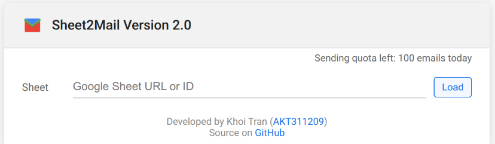

# Sheet2Mail Usage Guide

## What is MailMerge?

MailMerge is a process that lets you send personalized emails to multiple recipients using a single template and a data source (like a spreadsheet). Each recipient gets a customized message with their own details (such as name, email, or other fields) automatically filled in.

Sheet2Mail is a Google Apps Script-based tool that enables MailMerge directly from your Google Sheets, making it easy to send bulk personalized emails.

---

## Features & Step-by-Step Usage

### 1. Setting Up Sheet2Mail

#### Method 1: Using the deployed web app
1. Visit this [link](https://url.khoi.io.vn/ggsheet2mail)
2. Authenticate with your Google Account.  
    _Note: You may need to click [Advanced] to enable the app to run, as Google will recognize the app as "Unverified."_

#### Method 2: Self-deployed
1. **Copy the Script**: Add the `YAMM_LIKE_MAILER.js` script and `YAMM_Like_Mailer_UI.html` file to your Google Apps Script project linked to your Google Sheet.
2. **Configure Permissions**: The first time you use the script, authorize it to access your Google account and send emails on your behalf.

---

### 2. Preparing Your Google Sheet

1. **Create a Sheet**: Use a Google Sheet with columns for each variable you want to use (e.g., `Email`, `First Name`, `Last Name`, etc.).
2. **Fill in Data**: Enter recipient data in each row. Each row represents one recipient.

**Note: Google Forms sheets are compatible with Sheet2Mail. You can skip this step if you are using a Google Form.**

---

### 3. Composing Your Email Template

1. **Open Google Sheet**.  
      
    In the UI, copy your Google Sheet URL or ID into the field and click "Load" to continue.  

    Note: You must have read permission for the sheet before loading.
2. **Select sheet**  
    In the second field, select the subsheet inside your Google Sheet that you want to use.
3. **Select rows**  
    Select the range of rows you want to use for sending emails. The default range is from the first row of the table to the end, so you usually don't need to change this.
4. **Select columns**  
    The utility will automatically detect columns with values, so you don't need to do anything with this field.
5. **Sender fields**  
    Enter your desired name (the name you want to appear as the sender). This field is optional.
6. **Select receiver column**  
    Choose a column in your sheet that contains the email addresses of recipients.
7. **Subject & Body**  
    Compose your email subject and body. Merge fields are supported here, and body formatting is also supported.

    Use the `{{merge_field}}` format for your merge fields.
8. **Placeholder mapping**  
    Click "Add Placeholder" to add a new placeholder.

    In the "Placeholder" column, enter your desired variable name (placeholder name). This is what you should use between `{{}}` for this particular merge field.

    Select a column in the "Sheet Column" field. The corresponding data from this column will be filled into placeholders in your email body and subject.

    Add a test value. This test value will be used when you send a test email to yourself.

---

### 4. Sending Test Emails
Before sending real emails, you can use the "Test" button to send an email to yourself with merge fields filled with your test data. This function is very helpful to check if your email format and merge fields work correctly.

---

### 5. Sending Emails

**You have 2 options:**

1. **Send immediately**  
    Emails will be sent immediately to recipients.
2. **Schedule send**  
    Emails will be sent at the date and time you set. You can choose these options from the menu after clicking Send > Schedule Send. Click the calendar icon to pick the date and time.

---

### 6. Tracking & Logs

After sending, a log will be shown even if sending fails. You can use this information to resend emails if needed.

---

## About Quota

Gmail enforces a daily sending quota for Google Sheets scripts. Details are available [here](https://developers.google.com/apps-script/guides/services/quotas#:~:text=4%2C000%20/%20day-,Email%20recipients%20per%20day,-100*%20/%20day).

**This limit is shown in the UI for reference; however, the data is retrieved from the Google API and may be incorrect in some cases.**

## Tips & Best Practices

- Avoid exceeding Gmail's daily sending limits.
- Always test before sending to all recipients.
- Use clear column headers and avoid special characters.
- Personalize your emails for better engagement.

---
